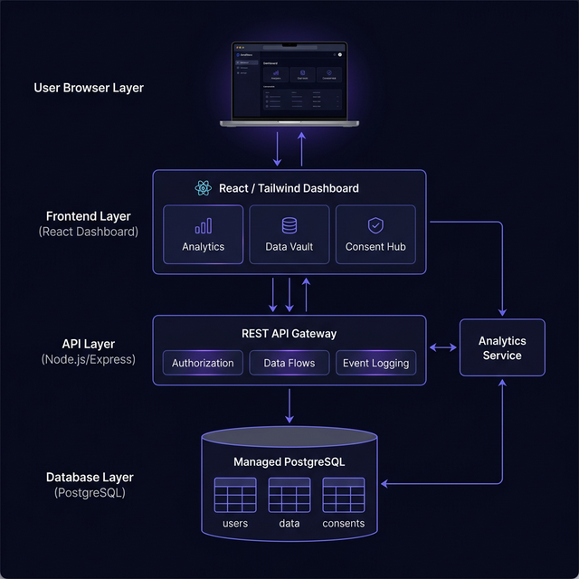

# ZeroShare – Privacy-First Data Consent Platform

ZeroShare is a modern, professional SaaS platform designed to put users back in control of their personal data. It allows users to store sensitive information in a private vault and manage granular consent requests from third-party applications.

## 🚀 Overview

In an era of data exploitation, ZeroShare provides a secure, transparent bridge between users and applications. Built with a "Privacy-by-Design" philosophy, it features a premium dashboard for real-time monitoring and a robust backend for managing data governance.

## ✨ Features

- **Personal Data Vault**: Securely store and manage your sensitive identity, health, and financial data.
- **Granular Consent Management**: Review, approve, or reject access requests from third-party apps with full transparency.
- **Real-time Audit Logs**: A chronological, immutable record of every data access event and consent decision.
- **Risk Assessment**: Clear visualization of request risk levels (Low, Medium, High).
- **Intuitive SaaS Dashboard**: A premium, high-contrast dark mode interface built with React.

## 🛠 Technology Stack

- **Frontend**: React (Vite), Lucide Icons, Custom Design System
- **Backend**: Node.js, Express
- **Database**: PostgreSQL
- **Infrastructure**: Docker

## 🏗 System Architecture

ZeroShare follows a modern layered architecture designed for security, scalability, and high-performance data processing.



### 1. Frontend Layer (React Dashboard)
A high-fidelity, responsive SPA built with **React** and **Tailwind CSS**. It leverages **shadcn/ui** for premium components and **Framer Motion** for cinematic animations. It handles real-time data visualization, granular consent management, and secure vault interactions.

### 2. Backend API Layer (Node.js / Express)
A robust **REST API Gateway** that serves as the logic engine. It manages cryptographic authorization flows, processes data access requests, and maintains an immutable ledger of system events.

### 3. Database Layer (PostgreSQL)
A managed **PostgreSQL** instance optimized for privacy governance. It stores encrypted user data, active consent permits, and comprehensive audit trails across structured tables including `users`, `user_data`, `consents`, and `audit_logs`.

### 4. Analytics & Governance Layer
A specialized sidecar service that aggregates system-wide metrics to generate real-time security insights and behavioral analytics for the user dashboard.

---

## 📂 Project Structure

```text
zeroshare/
├── frontend/    # React SPA dashboard
├── backend/     # Express REST API
├── database/    # SQL schema and seeding scripts
├── docs/        # Project documentation & assets
└── docker/      # Infrastructure configuration
```

## ⚙️ Installation Guide

### Prerequisites
- [Node.js](https://nodejs.org/) (v16+)
- [Docker & Docker Desktop](https://www.docker.com/products/docker-desktop/) (for PostgreSQL)

### 1. Database Setup
We use Docker to run a portable PostgreSQL instance:
```bash
docker run --name zeroshare-db -e POSTGRES_PASSWORD=password -e POSTGRES_DB=zeroshare -p 5432:5432 -d postgres:15-alpine
```

### 2. Backend Setup
```bash
cd backend
npm install
cp .env.example .env
# Ensure .env values match your database credentials
node database/seed.js # Initial data seed
node server.js
```

### 3. Frontend Setup
```bash
cd frontend
npm install
cp .env.example .env
npm run dev
```

## 📡 API Endpoints

### Consents
- `GET /api/consents/list` - Fetch all consent requests
- `POST /api/consents/approve` - Approve a request
- `POST /api/consents/reject` - Reject a request

### Audit Logs
- `GET /api/audit/list` - Fetch system event history

## 🔮 Future Enhancements
- [ ] End-to-end encryption for vault data.
- [ ] OAuth2 integration for 3rd party authentication.
- [ ] Automated compliance reporting (GDPR/CCPA).
- [ ] Mobile application for on-the-go consent management.

---
Built with ❤️ for Privacy.
