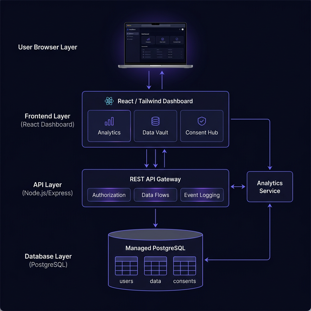

# ZeroShare – Privacy-First Data Consent Platform

ZeroShare is a full-stack SaaS platform that puts users in control of their personal data. Users store sensitive information in an encrypted vault and manage granular consent requests from third-party apps and websites — with real-time risk scoring powered by an ML microservice.



## ✨ Features

- **Encrypted Data Vault** — AES-256 encrypted storage for identity, health, and financial records
- **Consent Management** — Approve, deny, or revoke third-party data access requests
- **ML Risk Scoring** — Rule-based scoring on day 1; auto-retrains nightly on real admin decisions
- **Real-time Notifications** — WebSocket-powered live alerts for consent events
- **Immutable Audit Logs** — Hash-chained audit trail for every data access event
- **2FA / OTP Auth** — Email-based OTP with session management
- **Admin Panel** — User management, suspension, analytics, and system-wide audit view
- **Security Center** — Active session management, anomaly detection, risk overview

## 🛠 Tech Stack

| Layer | Technology |
|---|---|
| Frontend | React 19, Vite, Tailwind CSS, shadcn/ui, Framer Motion |
| Backend | Node.js, Express 5, PostgreSQL, WebSockets |
| ML Service | Python 3.11, FastAPI, custom logistic regression |
| Infrastructure | Docker, Docker Compose, Nginx |
| CI | GitHub Actions |

## 📂 Project Structure

```
zeroshare/
├── frontend/        # React SPA (Vite + Nginx in Docker)
├── backend/         # Express REST API + WebSocket server
├── ml-service/      # FastAPI ML risk scoring microservice
├── database/        # SQL schema and seed scripts
├── docs/            # Architecture diagram, ML documentation
└── docker-compose.yml
```

## 🚀 Quick Start (Docker — recommended)

### Prerequisites
- [Docker Desktop](https://www.docker.com/products/docker-desktop/)

### 1. Configure environment
```bash
cp backend/.env.example backend/.env
```

Edit `backend/.env` and set:
- `ENCRYPTION_KEY` — 64 hex chars: `node -e "console.log(require('crypto').randomBytes(32).toString('hex'))"`
- `JWT_SECRET` — long random string: `node -e "console.log(require('crypto').randomBytes(64).toString('hex'))"`
- `SMTP_USER`, `SMTP_PASS`, `SMTP_FROM` — Gmail app password for OTP emails

### 2. Start all services
```bash
docker compose up --build
```

| Service | URL |
|---|---|
| Frontend | http://localhost |
| Backend API | http://localhost:5001 |
| ML Service | http://localhost:8000 |

### 3. Create admin user
```bash
docker exec -it zeroshare_api node database/create-admin.js
```

---

## 🔧 Local Development (without Docker)

### Backend
```bash
cd backend
npm install
cp .env.example .env   # fill in values
node database/seed.js  # optional: seed demo data
npm run dev
```

### Frontend
```bash
cd frontend
npm install
npm run dev            # runs on http://localhost:5173
```

### ML Service
```bash
cd ml-service
pip install -r requirements.txt
uvicorn main:app --reload --port 8000
```

---

## 🔑 Key Environment Variables

| Variable | Required | Description |
|---|---|---|
| `ENCRYPTION_KEY` | ✅ | 64-char hex key for AES-256 vault encryption |
| `JWT_SECRET` | ✅ | Secret for signing JWT tokens |
| `DATABASE_URL` | ✅ | PostgreSQL connection string |
| `SMTP_USER` / `SMTP_PASS` | ✅ | Gmail credentials for OTP emails |
| `FRONTEND_URL` | ✅ | Used in password reset email links |

## 📡 API Overview

| Route | Description |
|---|---|
| `POST /api/auth/register` | Register new user |
| `POST /api/auth/login` | Login (returns JWT or OTP challenge) |
| `GET /api/consents` | List consent requests |
| `PATCH /api/consents/:id` | Approve / deny / revoke consent |
| `GET /api/audit` | Fetch audit log |
| `GET /api/data` | List vault records |
| `POST /api/data` | Add vault record |
| `GET /api/analytics/summary` | Dashboard analytics |
| `POST /api/ml/score` | Score a consent request |
| `GET /health` | Backend health check |

## 🧪 Tests

```bash
# Frontend
cd frontend && npm test

# Backend (syntax check)
cd backend && node --check server.js

# ML service (syntax check)
python -m py_compile ml-service/main.py
```

---

Built with ❤️ for Privacy.
